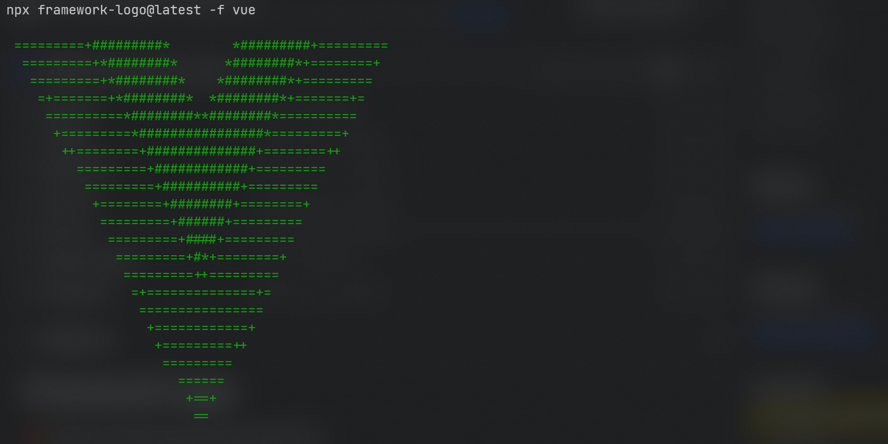

# Framework Logo

⚡️ Print your favorite framework logo and details into the cli.

## Usage

npx framework-logo@latest -f [framework]

    Options:
    -f, --framework prints the frameworks logo
    -h, --help display help for command

## Feature

Currently supports the following frameworks

- Angular
- React
- Vue
- Svelte
- Next
- Nuxt
- Svelte Kit

## Vision and Roadmap

- Include all framework's Icons of JS Ecosystem
	- Preact
	- Gatsby
	- Qwik 
	- Remix
	- Gridsome
	- Signal

- Print Details
	- Current Version
	- Last Updated
	- Author
	- Created Year
	- GitHub Link
	- Website Link

- Run Create Commend
